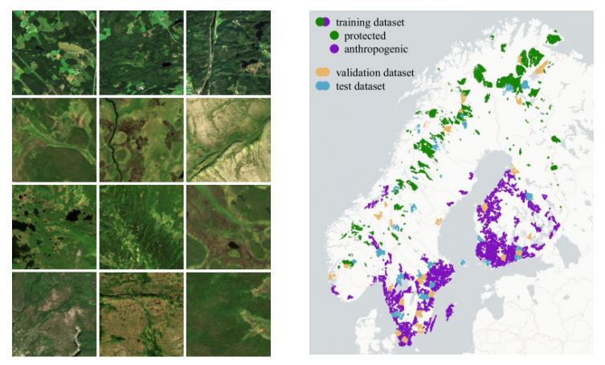

# M.Sc. Thesis: Deep Learning on Satellite Data for Wilderness Investigation

    

This is the repository for my M.Sc. thesis project, developed with joint supervision from Politecnico di Milano :it: and the University of Bonn :de:. 
The thesis adopts Deep Learning methods applied to a Sentinel-2 satellite images dataset (anthroprotect) to find the optimal data configuration and NN architecture to investigate wilderness.

Since the project is a **WORK IN PROGRESS**, I will be updating it regularly with new code.
Once the thesis will be submitted, I will take care of putting up the correct documentation.

For now, enjoy, and peruse through the current material :smile:

